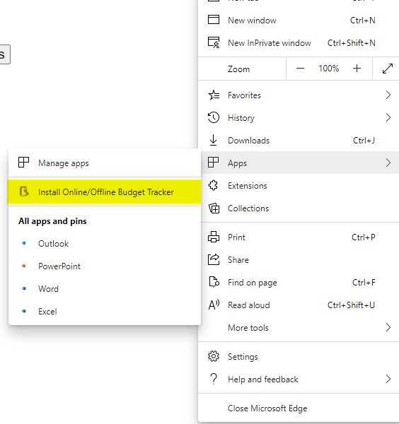
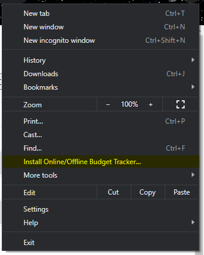
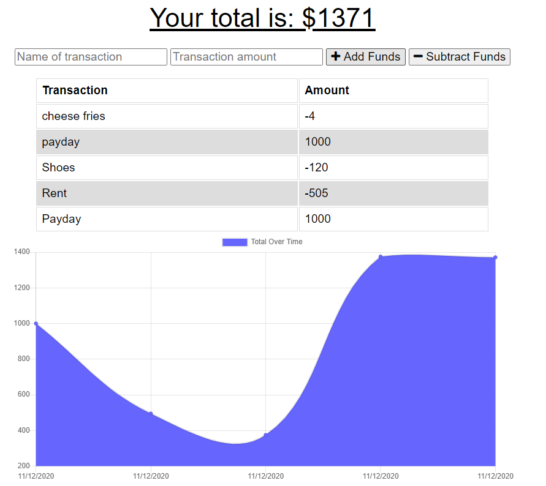
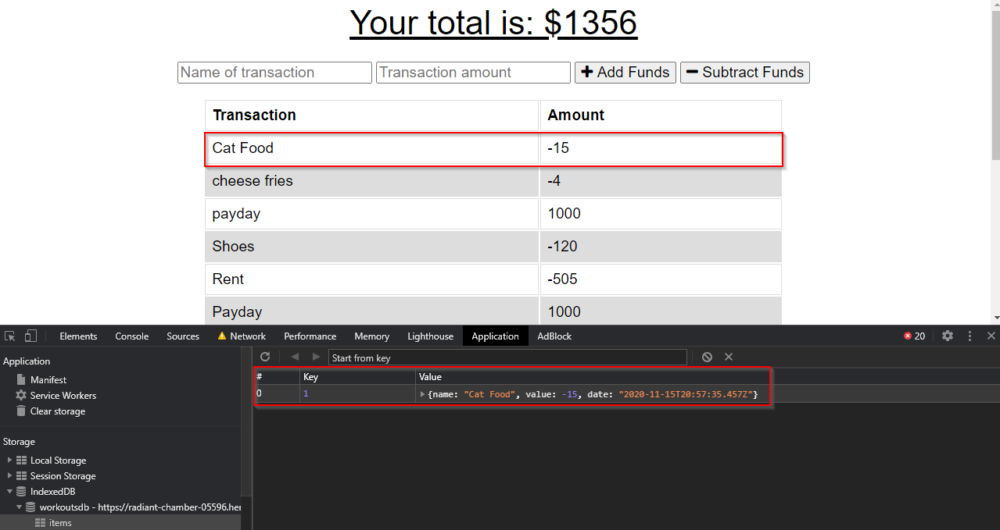

# Budget-Tracker

#### Table of Contents
  * [Description](#Description)
  * [Installation](#Installation)
  * [Screenshots](#Screenshots)
  * [Credits](#Credits)
  * [License](#License)

## Description
Track your incoming and outgoing transactions on or offline! While offline, transactions are cached using indexedDB. As soon as the application goes online, the records in indexedDB are pushed to a mongo database.

Click [Here](https://radiant-chamber-05596.herokuapp.com/) to view the Heroku deployment.
 
## Installation
#### Technologies Used
* HTML/CSS/JavaScript
* [MongoDB](https://www.mongodb.com/)
* [Node](https://nodejs.org/en/) and [npm](https://www.npmjs.com/package/npm)
* [Visual Studio Code](https://code.visualstudio.com/)
* [cmder](https://cmder.net/)
* [Heroku](https://www.heroku.com/home)

#### Steps
1. * Start by entering the following in your terminal: `Git clone https://github.com/whackingMUFN/Budget-Tracker.git`

2. * Change directory to `Budget-Tracker` and enter `npm install` into your terminal. This will install all package dependencies.

3. * Add node_modules to .gitignore.

4. * Start the application by running `npm start`

5. * Application can be installed to the desktop by clicking "install" in the settings of the browser.
    * Microsoft Edge
        * 
    * Google Chrome
        * 

## Screenshots
#### Budget Tracker Base

#### Offline IndexedDB Example
 

## Credits
This assignment was provided by Trilogy Education Services. Front end provided by Trilogy Education Services. Connection/Setup to MongoDB and IndexedDB, Service-Worker, and Manifest were created based on in class activities and lectures, [MDN](https://developer.mozilla.org/en-US/) Reference Documents for JavaScript syntax [JSHint](https://jshint.com/) for JavaScript validation, and various other online resources. 
## License

[License](LICENSE)
MIT &copy; 2020 Calvin Freese
